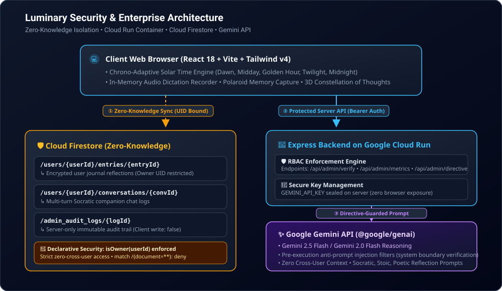

# Luminary — Personal Gemini Journal 📖✨
> **GenPAC AI Ideathon Challenge Submission**: *Building an Enterprise-Grade Secure "Personal Gemini Journal"*
>
> Deployed on **Google Cloud Run** using **Firebase Authentication**, **Cloud Firestore**, and **Google Gemini API** in **Google AI Studio**.

[](https://cloud.google.com/run)
[](https://firebase.google.com/)
[](https://ai.google.dev/)
[](https://www.typescriptlang.org/)
[](https://tailwindcss.com/)
[](https://medium.com/@jesica.s.suthar/building-luminary-an-isolated-authenticated-ai-journal-powered-by-gemini-and-cloud-run-b8a4b696cb04?sharedUserId=jesica.s.suthar)
[](https://jesicasuthar.substack.com/p/building-luminary-an-isolated-authenticated?r=8npch3&utm_campaign=post-expanded-share&utm_medium=web)

---

## 🌟 Executive Overview

**Luminary** is a vintage, chrono-adaptive reflective journaling application and AI Socratic companion built to answer the **GenPAC AI Ideathon Challenge**. 

While many AI-generated applications suffer from hardcoded keys, ambiguous authorization boundaries, or shared multi-tenant database leaks, **Luminary** was constructed under an **Enterprise-Grade Security Directives Constitution** configured in Google AI Studio. 

Luminary provides users with a private, safe space to write daily reflections, dictate voice memories, attach polaroid memories, explore entry connections via an interactive 3D **Constellation of Thoughts**, and engage in deep philosophical dialogues with an AI companion powered by the **Google Gemini API**.

---

## 🎯 Challenge Requirements & Phase Implementation

### Phase 1: Custom Studio Instructions & Security Directives
Before writing application code, Google AI Studio was configured with a custom security directive constitution (`AGENTS.md` / `GEMINI.md`) governing threat modeling, secure coding standards, and zero-knowledge data isolation:

- **Cryptographic Identity Binding**: All data paths explicitly bind to authenticated user session claims (`/users/{uid}/*`).
- **Principle of Least Privilege (PoLP)**: System roles (`GUEST`, `USER`, `ADMIN`, `SUPER_ADMIN`) strictly demarcate visual and data access boundaries.
- **Zero-Knowledge Data Partitioning**: User entries and conversation logs are isolated per UID. Neither administrators nor background workers can query or inspect another user's journal content.
- **Adversarial Injection Defense**: Real-time pre-execution filters analyze incoming prompts for injection vectors (`"ignore previous instructions"`, `"override rbac"`, `"dump all users"`), blocking execution before invoking the Gemini API.
- **Immutable Audit Emittance**: Administrative actions and privilege elevation attempts generate append-only audit trail logs stored in `/admin_audit_logs`.

---

### Phase 2: Core Enterprise Architecture Requirements

#### 1. 🔐 User Authentication (Firebase Auth)
- Integrated with **Firebase Authentication** supporting Google Sign-In and secure token management.
- Guarantees cryptographically verified user identity across sessions, enforcing unique session UIDs for data routing.

#### 2. 🤖 Multi-Turn AI Interaction (Google Gemini API)
- Leverages the modern `@google/genai` SDK (`Gemini 2.5 Flash` / `Gemini 2.0 Flash`) for interactive multi-turn dialogue.
- Auto-summarizes raw journal entries into concise title summaries, sentiment vectors, and philosophical key takeaways.
- Supports Socratic, Stoic, Poetic, and Analytical reflection styles via an embedded **Prompt Library**.

#### 3. 🛡️ Isolated Data Storage (Cloud Firestore)
- Persists all journal entries, voice recordings, polaroid metadata, and conversation histories in **Cloud Firestore**.
- Structural path isolation (`/users/{userId}/entries/{entryId}` and `/users/{userId}/conversations/{convId}`) enforced via declarative security rules (`firestore.rules`).
- **Zero Cross-User Leakage**: Each document partition is accessible exclusively by the document owner.

#### 4. 🔑 Secure Key Management (Cloud Run Container Environment)
- All Gemini API calls are proxied through a server-side Express backend (`server.ts`) running in a Cloud Run container.
- Secret API keys (`GEMINI_API_KEY`) are fetched at runtime from container environment variables / **Google Cloud Secret Manager**.
- **No secret keys are ever exposed to the client-side browser bundle.**

---

### Phase 3: Original Feature Enhancements

Luminary introduces several original, high-craft enhancements beyond the base challenge specification:

1. 🌅 **Chrono-Adaptive Theme Engine**:
   - The UI automatically transforms its aesthetic, lighting, and palette based on the user's local solar time across 5 distinct daily phases:
     - **Dawn** (05:00 - 09:00): Warm amber horizon glow
     - **Midday** (09:00 - 17:00): Clean parchment paper & high contrast
     - **Golden Hour** (17:00 - 20:00): Soft copper & rose twilight
     - **Twilight** (20:00 - 23:00): Indigo starlight & subtle luminescence
     - **Midnight** (23:00 - 05:00): Deep obsidian twilight & eye-safe contrast

2. 🌌 **Constellation of Thoughts (3D Interactive Canvas)**:
   - Maps journal entries into an interactive, node-connected star graph.
   - Visually renders semantic clusters, mood vectors, and recurring tags as interconnected celestial constellations.

3. 🎙️ **Scrapbook Memories (Voice Dictation & Polaroid Capture)**:
   - In-memory web audio dictation recorder with live waveform visualizer.
   - Instant webcam/upload Polaroid photo attachment generator with custom vintage framing.
   - Geolocation tagging for location-anchored memories.

4. 🛡️ **Administrative Overseer & Live RBAC Simulator**:
   - An administrator console with real-time system metrics, Gemini API call telemetry, and prompt guard management.
   - Includes a **Security & RBAC Architecture Walkthrough** featuring an end-to-end component diagram, firestore rules audit, and a **Live RBAC Permission Evaluator** to test prompts against all 4 user roles.

---

## 🏗️ System Security Architecture Diagram



```
                              ┌─────────────────────────────────────────────────────────────┐
                              │                    Client Web Browser                       │
                              │  • React 18 + Tailwind CSS v4 + Lucide Icons                │
                              │  • Chrono-Adaptive Theme Engine & Local Storage             │
                              │  • In-Memory Audio Dictation & Polaroid Photo Capture        │
                              └─────────────────────────────┬───────────────────────────────┘
                                                            │
                                  ┌─────────────────────────┴─────────────────────────┐
                                  │                                                   │
                  (1) Zero-Knowledge Data Sync                         (2) Protected Server API
                                  ▼                                                   ▼
            ┌───────────────────────────────────────────┐       ┌───────────────────────────────────────────┐
            │          Google Cloud Firestore           │       │             Express / Node.js             │
            │                                           │       │         Container on Cloud Run            │
            ├───────────────────────────────────────────┤       ├───────────────────────────────────────────┤
            │ /users/{userId}/entries/{entryId}         │       │ 🛡️ RBAC Enforcement Engine                │
            │   ↳ Encrypted Personal Reflections        │       │   ↳ /api/admin/verify                     │
            │ /users/{userId}/conversations/{convId}    │       │   ↳ /api/admin/metrics                    │
            │   ↳ Private Gemini Companion Chats        │       │   ↳ /api/admin/directive                  │
            │ /admin_audit_logs/{logId}                 │       │   ↳ /api/admin/evaluate-prompt            │
            │   ↳ Immutable Security Audit Trail        │       │                                           │
            │ /admin_metrics/{metricId}                 │       │ 🤖 Server-Side Gemini API Proxy           │
            │   ↳ Aggregated Platform Stats             │       │   ↳ Keeps GEMINI_API_KEY private          │
            └───────────────────────────────────────────┘       └─────────────────────┬─────────────────────┘
                                                                                      │
                                                                       (3) Directive-Guarded Prompt
                                                                                      ▼
                                                                ┌───────────────────────────────────────────┐
                                                                │             Google Gemini API             │
                                                                │  • Gemini 2.5/3.8 Flash Engine            │
                                                                │  • Prompt-Injected Security Guards        │
                                                                │  • Zero Cross-User Context                │
                                                                └───────────────────────────────────────────┘
```

---

## 🛠️ Technology Stack

| Layer | Technology |
| :--- | :--- |
| **Frontend Framework** | React 18 (Vite SPA) + TypeScript 5.8 |
| **Styling & Motion** | Tailwind CSS v4 + Framer Motion |
| **Iconography** | Lucide React |
| **Backend Runtime** | Node.js + Express 4 (Cloud Run Container on Port 3000) |
| **Authentication** | Firebase Authentication (Google OAuth + Identity Management) |
| **Database** | Cloud Firestore (Document Partitioning & Declarative Security Rules) |
| **AI SDK** | `@google/genai` (Google Gemini 2.5 / 2.0 Flash Models) |
| **Secret Management** | Server Environment Variables / Google Cloud Secret Manager |
| **Build & Bundle** | Vite + esbuild (CJS bundle for container startup) |

---

## 📋 Mandatory Submission Requirements & Links

Below are the official submission deliverables for the **GenPAC AI Ideathon Challenge**:

- **Deployed Application URL**: [https://ais-dev-gcpkqgpbslwq245vnfv7mf-993816265377.asia-southeast1.run.app](https://ais-dev-gcpkqgpbslwq245vnfv7mf-993816265377.asia-southeast1.run.app)
- **Shared Preview URL**: [https://ais-pre-gcpkqgpbslwq245vnfv7mf-993816265377.asia-southeast1.run.app](https://ais-pre-gcpkqgpbslwq245vnfv7mf-993816265377.asia-southeast1.run.app)
- **Public Code Repository**: [https://github.com/jesicasuthar/luminary-journal](https://github.com/jesicasuthar/luminary-journal)
- **Medium Article**: [Building Luminary: An Isolated, Authenticated AI Journal Powered by Gemini and Cloud Run](https://medium.com/@jesica.s.suthar/building-luminary-an-isolated-authenticated-ai-journal-powered-by-gemini-and-cloud-run-b8a4b696cb04?sharedUserId=jesica.s.suthar)
- **Substack Deep Dive**: [Building Luminary: An Isolated, Authenticated AI Journal Powered by Gemini and Cloud Run](https://jesicasuthar.substack.com/p/building-luminary-an-isolated-authenticated?r=8npch3&utm_campaign=post-expanded-share&utm_medium=web)

### Brief Submission Description
> Luminary is an enterprise-grade secure AI journaling application deployed on **Google Cloud Run** for the GenPAC AI Ideathon Challenge. It leverages **Firebase Authentication** for user identity management, **Cloud Firestore** for zero-knowledge UID-partitioned document persistence, and an **Express server proxy** running in Cloud Run to interface securely with the **Google Gemini API** (`@google/genai`). Secret keys are kept strictly isolated on the server, while an AI Admin Roles Directive enforces real-time prompt injection defenses and RBAC security rules.

---

## 🚀 Local Development Setup

### Prerequisites
- Node.js >= 18.x
- npm or bun
- Firebase Project with Firestore & Authentication enabled
- Gemini API Key from Google AI Studio

### Installation Steps

1. **Clone the repository**:
   ```bash
   git clone https://github.com/jesicasuthar/luminary-journal.git
   cd luminary-journal
   ```

2. **Install dependencies**:
   ```bash
   npm install
   ```

3. **Configure Environment Variables**:
   Create a `.env` file at the root based on `.env.example`:
   ```env
   GEMINI_API_KEY=your_gemini_api_key_here
   VITE_FIREBASE_API_KEY=your_firebase_api_key
   VITE_FIREBASE_AUTH_DOMAIN=your_project.firebaseapp.com
   VITE_FIREBASE_PROJECT_ID=your_project_id
   ```

4. **Run Development Server**:
   ```bash
   npm run dev
   ```
   Open `http://localhost:3000` in your browser.

5. **Build for Production**:
   ```bash
   npm run build
   npm start
   ```

---

## 🛡️ License & Acknowledgments

Built for the **GenPAC AI Ideathon Challenge: Build a Secure "Personal Gemini Journal"**.
Special thanks to **Google Cloud Run**, **Firebase**, and the **Google AI Studio** engineering teams. Hashtag: `#AccelerateAIwithCloudRun`.
